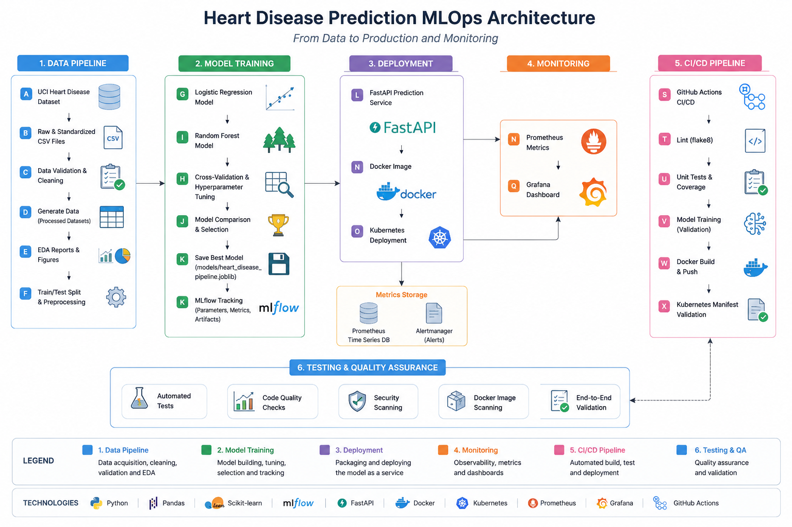

# Heart Disease MLOps

[](https://github.com/2024ac05147-bits/heart-disease-mlops)

An end-to-end Machine Learning Operations project that acquires the UCI Heart Disease dataset, performs data validation and exploratory analysis, trains and compares classification models, tracks experiments with MLflow, exposes the selected model through FastAPI, packages it with Docker, deploys it to Kubernetes, and monitors it using Prometheus and Grafana.

> **Academic and medical disclaimer:** This project is an academic demonstration. It is not intended for clinical diagnosis, treatment, or medical decision-making.

---

## Project objective

Build a reproducible and deployable classifier that predicts the presence or absence of heart disease from patient health attributes while demonstrating modern MLOps practices:

- reproducible data acquisition and preprocessing;
- exploratory data analysis;
- model training and hyperparameter tuning;
- experiment tracking with MLflow;
- model packaging;
- automated testing and CI/CD;
- Docker containerization;
- Kubernetes deployment;
- API monitoring with Prometheus and Grafana.

---

## Architecture

<p align="center">
  
</p>

---

## Repository

Public repository:

```text
https://github.com/2024ac05147-bits/heart-disease-mlops
```

---

## Technology stack

| Area | Tools |
|---|---|
| Language | Python 3.13 |
| Data processing | Pandas, NumPy |
| Visualization | Matplotlib, Seaborn |
| Machine learning | Scikit-learn |
| Experiment tracking | MLflow |
| API | FastAPI, Uvicorn |
| Testing | Pytest, pytest-cov |
| Code quality | Ruff |
| Packaging | Joblib |
| Containerization | Docker |
| Orchestration | Kubernetes, Minikube, Kustomize |
| Monitoring | Prometheus, Grafana |
| CI/CD | GitHub Actions |

---

## Repository structure

```text
heart-disease-mlops/
├── .github/
│   └── workflows/
│       └── ci.yml
├── app/
│   ├── main.py
│   ├── metrics.py
│   └── schemas.py
├── data/
│   ├── raw/
│   └── processed/
├── deployment/
│   ├── kubernetes/
│   └── monitoring/
├── models/
│   ├── heart_disease_pipeline.joblib
│   └── model_metadata.json
├── reports/
│   ├── figures/
│   └── model_evaluation/
├── screenshots/
├── scripts/
│   ├── download_data.py
│   ├── generate_eda.py
│   └── train.py
├── src/
│   ├── config.py
│   ├── data_processing.py
│   └── evaluation.py
├── tests/
├── Dockerfile
├── pytest.ini
├── requirements.txt
├── sample_request.json
└── README.md
```

---

# Prerequisites

Install the following tools before starting:

1. Git
2. Python 3.13, 64-bit
3. Docker Desktop
4. kubectl
5. Minikube

Recommended machine capacity:

- 8 GB RAM or more;
- at least 15 GB free disk space;
- hardware virtualization enabled;
- internet access to GitHub, PyPI, and public Docker registries.

---

## Verify installed tools

These commands work in:

- Windows Command Prompt;
- PowerShell;
- IntelliJ IDEA Terminal when configured to use either Command Prompt or PowerShell.

```bat
git --version
python --version
docker --version
docker compose version
kubectl version --client
minikube version
```

Expected Python version:

```text
Python 3.13.x
```

Confirm Docker Desktop is running:

```bat
docker info
docker run --rm hello-world
```

Do not continue until both Docker commands succeed.

---

# 1. Clone the repository

## Command Prompt or IntelliJ Terminal

```bat
git clone https://github.com/2024ac05147-bits/heart-disease-mlops.git
cd heart-disease-mlops
```

## PowerShell

```powershell
git clone https://github.com/2024ac05147-bits/heart-disease-mlops.git
Set-Location heart-disease-mlops
```

Verification:

```bat
git status
```

---

# 2. Create the Python environment

## Command Prompt

```bat
py -3.13 -m venv venv
venv\Scripts\activate
```

## PowerShell

```powershell
py -3.13 -m venv venv
.\venv\Scripts\Activate.ps1
```

When PowerShell blocks activation:

```powershell
Set-ExecutionPolicy -Scope Process -ExecutionPolicy Bypass
.\venv\Scripts\Activate.ps1
```

## IntelliJ IDEA

1. Open the repository folder.
2. Open **File → Settings → Project → Python Interpreter**.
3. Select **Add Interpreter → Existing**.
4. Choose:

```text
<repository>\venv\Scripts\python.exe
```

5. Open the built-in Terminal and confirm:

```bat
python --version
```

---

# 3. Install dependencies

Objective: install all Python packages required for data processing, training, tracking, testing, and API serving.

```bat
python -m pip install --upgrade pip
python -m pip install -r requirements.txt
python -m pip check
```

Verification:

```bat
python -c "import pandas, sklearn, mlflow, fastapi; print('Dependencies loaded successfully')"
```

---

# 4. Download and standardize the dataset

Objective: download and standardize the Heart Disease UCI source datasets.

```bat
python scripts\download_data.py
```

Expected output includes:

```text
Combined dataset shape: (920, 17)
```

Generated files:

```text
data/raw/heart_disease_uci.csv
data/raw/dataset_summary.json
data/raw/standardized_sources/cleveland.csv
data/raw/standardized_sources/hungarian.csv
data/raw/standardized_sources/switzerland.csv
data/raw/standardized_sources/va_long_beach.csv
```

Verification:

```bat
python -c "import pandas as pd; df=pd.read_csv('data/raw/heart_disease_uci.csv'); print(df.shape); print(df['target'].value_counts())"
```

---

# 5. Generate exploratory data analysis

Objective: generate professional EDA outputs covering histograms, class balance, correlation, missingness, feature relationships, source distributions, and target-rate comparisons.

```bat
python scripts\generate_eda.py
```

Expected output:

```text
EDA completed for 918 records.
```

Generated files:

```text
reports/eda_summary.json
reports/eda_summary.txt
reports/figures/
```

Key figures include:

```text
reports/figures/class_distribution.png
reports/figures/correlation_heatmap.png
reports/figures/missing_value_percentage.png
reports/figures/missingness_by_source.png
reports/figures/numerical_histograms.png
reports/figures/chest_pain_disease_rate.png
reports/figures/target_rate_by_source.png
reports/figures/thalach_by_target_boxplot.png
```

Verification:

```bat
type reports\eda_summary.txt
```

PowerShell equivalent:

```powershell
Get-Content reports\eda_summary.txt
```

---

# 6. Train and compare models

Objective:

- clean the data;
- split it into stratified train and test sets;
- build reusable preprocessing pipelines;
- train Logistic Regression and Random Forest;
- tune model hyperparameters;
- evaluate with cross-validation and holdout metrics;
- log experiments to MLflow;
- package the best model.

```bat
python scripts\train.py
```

Expected output:

```text
Training Logistic Regression...
Training Random Forest...
Training workflow completed.
Selected model: Logistic Regression
```

Generated files:

```text
data/processed/heart_disease_clean.csv
models/heart_disease_pipeline.joblib
models/model_metadata.json
reports/model_comparison.csv
reports/model_evaluation/
mlflow.db
mlartifacts/
```

Verification:

## Command Prompt

```bat
type models\model_metadata.json
type reports\model_comparison.csv
```

## PowerShell

```powershell
Get-Content models\model_metadata.json
Get-Content reports\model_comparison.csv
```

The selected pipeline contains:

- numerical median imputation;
- numerical missing-value indicators;
- numerical scaling;
- categorical imputation;
- one-hot encoding;
- final classifier.

---

# 7. Inspect MLflow experiments

Objective: view tracked parameters, metrics, artifacts, plots, and models.

```bat
python -m mlflow server --backend-store-uri sqlite:///mlflow.db --default-artifact-root ./mlartifacts --host 127.0.0.1 --port 5000
```

Open:

```text
http://127.0.0.1:5000
```

Expected experiment:

```text
heart-disease-classification
```

Inspect both runs:

- Logistic Regression
- Random Forest

Stop the MLflow server using:

```text
Ctrl+C
```

---

# 8. Run formatting, linting, tests, and coverage

## Check formatting

```bat
python -m ruff format --check app src scripts tests
```

## Run linting

```bat
python -m ruff check app src scripts tests
```

## Run tests

```bat
python -m pytest -v
```

## Run tests with coverage

### Command Prompt

```bat
python -m pytest --cov=app --cov=src --cov-report=term-missing --cov-report=html --cov-report=xml:coverage.xml -v
```

### PowerShell

```powershell
python -m pytest `
  --cov=app `
  --cov=src `
  --cov-report=term-missing `
  --cov-report=html `
  --cov-report=xml:coverage.xml `
  -v
```

Expected:

```text
18 passed
Coverage approximately 71% or higher
```

Coverage report:

```text
htmlcov/index.html
```

Open it directly from IntelliJ or through a browser.

---

# 9. Run the FastAPI service locally

Objective: serve the packaged model without Docker.

```bat
python -m uvicorn app.main:app --host 127.0.0.1 --port 8000
```

Open Swagger UI:

```text
http://127.0.0.1:8000/docs
```

Available endpoints:

| Endpoint | Purpose |
|---|---|
| `GET /` | API information |
| `GET /health` | General health |
| `GET /health/live` | Liveness |
| `GET /health/ready` | Model readiness |
| `POST /predict` | Prediction |
| `GET /metrics` | Prometheus metrics |

Keep this terminal running and test from a second terminal.

## Health checks

### Command Prompt

```bat
curl http://127.0.0.1:8000/health/live
curl http://127.0.0.1:8000/health/ready
```

### PowerShell

```powershell
Invoke-RestMethod http://127.0.0.1:8000/health/live
Invoke-RestMethod http://127.0.0.1:8000/health/ready
```

## Prediction test

### Command Prompt

```bat
curl -X POST http://127.0.0.1:8000/predict -H "Content-Type: application/json" --data-binary "@sample_request.json"
```

### PowerShell

```powershell
$body = Get-Content sample_request.json -Raw

Invoke-RestMethod `
  -Uri http://127.0.0.1:8000/predict `
  -Method Post `
  -ContentType application/json `
  -Body $body |
  ConvertTo-Json
```

Expected response structure:

```json
{
  "prediction": 1,
  "risk_class": "Disease risk detected",
  "confidence": 0.8061,
  "probability_no_disease": 0.1939,
  "probability_disease": 0.8061,
  "model_name": "Logistic Regression",
  "disclaimer": "This model is an academic demonstration and is not intended for clinical diagnosis or treatment decisions."
}
```

Stop the API using:

```text
Ctrl+C
```

---

# 10. Build and run the Docker image

Objective: package the API, model, preprocessing pipeline, dependencies, and runtime into an isolated image.

Ensure Docker Desktop is running.

## Build

```bat
docker build -t heart-disease-api:1.0.0 .
```

Verify:

```bat
docker image inspect heart-disease-api:1.0.0
```

## Run

```bat
docker run --detach --name heart-disease-api --publish 8000:8000 heart-disease-api:1.0.0
```

Wait approximately 15 seconds.

```bat
docker ps
docker inspect --format="{{.State.Health.Status}}" heart-disease-api
```

Expected health status:

```text
healthy
```

## Test the container

### Command Prompt

```bat
curl http://127.0.0.1:8000/health/ready
curl -X POST http://127.0.0.1:8000/predict -H "Content-Type: application/json" --data-binary "@sample_request.json"
```

### PowerShell

```powershell
Invoke-RestMethod http://127.0.0.1:8000/health/ready

$body = Get-Content sample_request.json -Raw

Invoke-RestMethod `
  -Uri http://127.0.0.1:8000/predict `
  -Method Post `
  -ContentType application/json `
  -Body $body |
  ConvertTo-Json
```

## Review logs

```bat
docker logs heart-disease-api
```

## Stop and remove

```bat
docker rm -f heart-disease-api
```

---

# 11. Deploy using Minikube and Kubernetes

Objective: deploy the Dockerized API with two replicas, health probes, resource controls, a Service, and optional Ingress.

## Start Minikube

```bat
minikube start --driver=docker --cpus=2 --memory=4096
```

Verification:

```bat
kubectl config current-context
kubectl get nodes
```

Expected context:

```text
minikube
```

Expected node status:

```text
Ready
```

## Load the local image

```bat
minikube image load heart-disease-api:1.0.0
```

### Command Prompt verification

```bat
minikube image ls | findstr heart-disease-api
```

### PowerShell verification

```powershell
minikube image ls | Select-String "heart-disease-api"
```

## Render the manifests

```bat
kubectl kustomize deployment\kubernetes
```

## Deploy

```bat
kubectl apply -k deployment\kubernetes
```

## Wait for rollout

### Command Prompt

```bat
kubectl rollout status deployment/heart-disease-api -n heart-disease --timeout=180s
```

### PowerShell

```powershell
kubectl rollout status `
  deployment/heart-disease-api `
  -n heart-disease `
  --timeout=180s
```

## Inspect resources

```bat
kubectl get deployments -n heart-disease
kubectl get pods -n heart-disease
kubectl get services -n heart-disease
```

Expected Pods:

```text
2 replicas
1/1 Running
```

## Access through port forwarding

```bat
kubectl port-forward service/heart-disease-api 8000:80 -n heart-disease
```

Keep this terminal running.

In another terminal:

```bat
curl http://127.0.0.1:8000/health/ready
curl -X POST http://127.0.0.1:8000/predict -H "Content-Type: application/json" --data-binary "@sample_request.json"
```

Stop port forwarding with:

```text
Ctrl+C
```

## Optional LoadBalancer tunnel

Run from an elevated terminal:

```bat
minikube tunnel
```

Then inspect:

```bat
kubectl get service heart-disease-api -n heart-disease
```

## Optional Ingress

```bat
minikube addons enable ingress
kubectl apply -f deployment\kubernetes\ingress.yaml
minikube ip
```

Map the Minikube IP to:

```text
heart-disease.local
```

Then open:

```text
http://heart-disease.local/docs
```

## Remove the deployment

```bat
kubectl delete -k deployment\kubernetes
minikube stop
```

---

# 12. Run Prometheus and Grafana monitoring

Objective:

- start the API;
- scrape `/metrics` with Prometheus;
- visualize API and prediction metrics in Grafana.

Ensure ports `8000`, `9090`, and `3000` are free.

## Validate Compose

```bat
docker compose -f deployment\monitoring\docker-compose.yml config
```

## Start monitoring

```bat
docker compose -f deployment\monitoring\docker-compose.yml up --build -d
```

## Verify services

```bat
docker compose -f deployment\monitoring\docker-compose.yml ps
```

Open:

| Service | URL |
|---|---|
| FastAPI | `http://127.0.0.1:8000/docs` |
| Prometheus targets | `http://127.0.0.1:9090/targets` |
| Grafana | `http://127.0.0.1:3000` |

Grafana credentials:

```text
Username: admin
Password: admin
```

## Generate sample prediction traffic

### Command Prompt

Run this command several times:

```bat
curl -X POST http://127.0.0.1:8000/predict -H "Content-Type: application/json" --data-binary "@sample_request.json"
```

### PowerShell

```powershell
$body = Get-Content sample_request.json -Raw

1..20 | ForEach-Object {
    Invoke-RestMethod `
      -Uri http://127.0.0.1:8000/predict `
      -Method Post `
      -ContentType application/json `
      -Body $body | Out-Null

    Start-Sleep -Milliseconds 250
}
```

Wait approximately 20 seconds, then refresh Grafana.

The provisioned dashboard includes:

- API availability;
- request count and request rate;
- total predictions;
- predictions by class;
- inference errors;
- p50 and p95 prediction latency;
- HTTP status distribution.

## Inspect Prometheus output directly

```bat
curl http://127.0.0.1:8000/metrics
```

Expected custom metrics include:

```text
heart_api_requests_total
heart_model_predictions_total
heart_model_prediction_errors_total
heart_model_prediction_seconds
```

## Stop monitoring

```bat
docker compose -f deployment\monitoring\docker-compose.yml down
```

Remove persisted monitoring volumes when required:

```bat
docker compose -f deployment\monitoring\docker-compose.yml down --volumes
```

---

# 13. GitHub Actions CI/CD

Workflow:

```text
.github/workflows/ci.yml
```

The pipeline runs automatically on:

- pushes to `main`;
- pull requests targeting `main`;
- manual workflow dispatch.

Pipeline order:

```text
Lint and format validation
        ↓
Unit tests and coverage
        ↓
EDA and model training
        ↓
Docker build and API smoke test
        ↓
Kubernetes manifest validation
```

The workflow fails when:

- formatting checks fail;
- Ruff reports errors;
- unit tests fail;
- coverage drops below the configured threshold;
- training fails;
- expected model artifacts are missing;
- packaged model inference fails;
- the Docker image fails to build;
- API readiness fails;
- prediction or metrics validation fails;
- Kubernetes manifests cannot be rendered.

Generated workflow artifacts include:

- JUnit test results;
- XML and HTML coverage;
- trained model and metadata;
- EDA figures;
- model evaluation outputs;
- MLflow database and artifacts;
- Docker health, prediction, logs, and inspection output;
- rendered Kubernetes manifests.

GitHub Actions page:

```text
https://github.com/2024ac05147-bits/heart-disease-mlops/actions
```

---

# 14. Key modelling results

| Model | CV ROC-AUC | Accuracy | Precision | Recall | F1 | Test ROC-AUC |
|---|---:|---:|---:|---:|---:|---:|
| Logistic Regression | 0.8898 | 0.8587 | 0.8654 | 0.8824 | 0.8738 | 0.9359 |
| Random Forest | 0.8889 | 0.8424 | 0.8544 | 0.8627 | 0.8585 | 0.9295 |

Selected model:

```text
Logistic Regression
```

Selection basis:

```text
Highest five-fold stratified cross-validation ROC-AUC
```

---

# 15. Main EDA findings

- The cleaned dataset contains 918 records.
- The positive target class represents approximately 55% of the cleaned dataset.
- Chest-pain category 4 has the highest observed disease-positive rate.
- Disease-positive records tend to involve older patients.
- Maximum achieved heart rate is generally lower among disease-positive records.
- ST depression is generally higher among disease-positive records.
- Missingness varies significantly across source hospitals.
- `ca`, `thal`, `slope`, and cholesterol have substantial missing data.
- Source-hospital disease rates should be interpreted as historical sample characteristics, not national population prevalence.

---

# 16. Evidence and screenshots

Screenshots are stored under:

```text
screenshots/
├── api/
├── ci/
├── docker/
├── eda/
├── kubernetes/
├── mlflow/
└── monitoring/
```

Recommended final evidence:

- EDA plots;
- MLflow experiment and model-run pages;
- API Swagger request and response;
- Pytest and coverage;
- successful GitHub Actions workflow;
- successful Docker build and running container;
- Kubernetes Pods, Deployment, and Service;
- Prometheus target state;
- Grafana dashboard.

---

# 17. Troubleshooting

## `current-context is not set`

Cause: no Kubernetes cluster is running.

Fix:

```bat
minikube start --driver=docker
kubectl config current-context
```

## Kubernetes uses `localhost:8080`

Cause: `kubectl` has no configured cluster context.

Fix:

```bat
minikube start --driver=docker
kubectl config use-context minikube
```

## PowerShell does not recognize `\` line continuation

PowerShell uses the backtick:

```powershell
`
```

Command Prompt usually requires a single-line command or caret:

```bat
^
```

The commands in this README include shell-specific examples where needed.

## Port 8000 is already in use

Find the process:

```bat
netstat -ano | findstr :8000
```

Or remove an existing Docker container:

```bat
docker rm -f heart-disease-api
```

## Docker image is not available inside Minikube

```bat
minikube image load heart-disease-api:1.0.0
```

## Pod reports `ImagePullBackOff`

Confirm:

```bat
minikube image ls | findstr heart-disease-api
```

The Kubernetes Deployment must use:

```text
image: heart-disease-api:1.0.0
imagePullPolicy: IfNotPresent
```

## MLflow file-store error

Use the configured SQLite backend:

```bat
python -m mlflow server --backend-store-uri sqlite:///mlflow.db --default-artifact-root ./mlartifacts --host 127.0.0.1 --port 5000
```

## Joblib or Scikit-learn compatibility warning

Reinstall the exact versions in `requirements.txt` and retrain:

```bat
python -m pip install -r requirements.txt
python scripts\train.py
```

## Grafana dashboard has no data

1. Confirm the API is healthy.
2. Confirm Prometheus target status is `UP`.
3. Send multiple prediction requests.
4. Wait at least one Prometheus scrape interval.
5. Refresh Grafana.

---

# 18. Cleanup

## Local Python artifacts

### Command Prompt

```bat
if exist htmlcov rmdir /s /q htmlcov
if exist .pytest_cache rmdir /s /q .pytest_cache
if exist coverage.xml del coverage.xml
if exist .coverage del .coverage
```

## Docker

```bat
docker rm -f heart-disease-api
docker image rm heart-disease-api:1.0.0
```

## Kubernetes

```bat
kubectl delete -k deployment\kubernetes
minikube stop
```

To remove the Minikube cluster completely:

```bat
minikube delete
```

## Monitoring

```bat
docker compose -f deployment\monitoring\docker-compose.yml down --volumes
```

---

# 19. Reproducibility checklist

Before submission, confirm:

```bat
python -m pip check
python -m ruff format --check app src scripts tests
python -m ruff check app src scripts tests
python -m pytest -v
python scripts\generate_eda.py
python scripts\train.py
docker build -t heart-disease-api:1.0.0 .
kubectl kustomize deployment\kubernetes
docker compose -f deployment\monitoring\docker-compose.yml config
git diff --check
git status
```

---

# 20. Future improvements

Potential enhancements include:

- threshold tuning based on clinical cost assumptions;
- probability calibration;
- model and feature drift monitoring;
- automated retraining;
- model registry promotion workflows;
- secured API authentication;
- HTTPS termination;
- cloud-managed Kubernetes deployment;
- external model and artifact storage;
- structured log aggregation;
- bias and fairness analysis;
- dedicated integration and load testing.

---

# Medical disclaimer

This project is an academic demonstration only. The dataset and model are not intended for real-world clinical use, diagnosis, treatment, triage, or medical decision-making. Model outputs may be inaccurate or misleading and must not replace evaluation by qualified healthcare professionals.